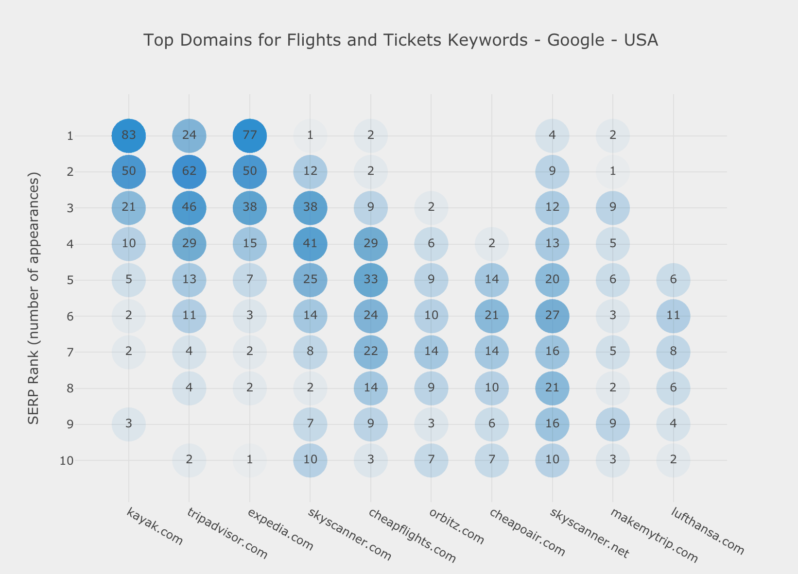

# Google Search Engine Results Pages Research

This dashboard connects to the [Google Custom Search Engine API](https://developers.google.com/custom-search/v1/cse/list), and retrieves SERP data for any requested keyword(s).  

* All results are returned as a `pandas` `DataFrame`.
* Multiple keywords can be supplied to one function call.
* Multiple parameters can also be supplied to the same function call. Many parameters are available; country, language, image color, image size, and much more. 
* Results are immediately visualized to immediately see which domains are ranking on which positions
* Full SERP table can be downloaded to analyze the raw data
* The top 10 domains are shown, so numbers might not add up to the total of queries

Sample visualization:

You can immediately see how many times a certain domain appeared on rank 1, 2, 3, and so on.  
This is more informative than a simple average position metric (which can also be visually estimated).  
The more transparent the circle the less the domain appeared on that position and vice versa.  
This should visually help in quickly locating the dominant positions. The numbers on each circle should be the final reference.  

Articles and case studies based on the `serp_goog` function from [`advertools`](https://github.com/eliasdabbas/advertools):

* [Tutorial on how to use the `serp_goog` function](https://www.kaggle.com/eliasdabbas/search-engine-results-pages-serps-research)
* [Analyzing search engine results pages on a large scale](https://www.semrush.com/blog/analyzing-search-engine-results-pages/)
* [SEO Data for Recipe Keywords - Google & YouTube](https://www.kaggle.com/eliasdabbas/recipes-keywords-ranking-on-google-and-youtube)
* [US 2018 Mid-term elections candidates on Google Search](https://www.kaggle.com/eliasdabbas/us-midterm-elections-2018-on-google-search)

[Try the interactive dashboard](https://www.dashboardom.com/google-serp)